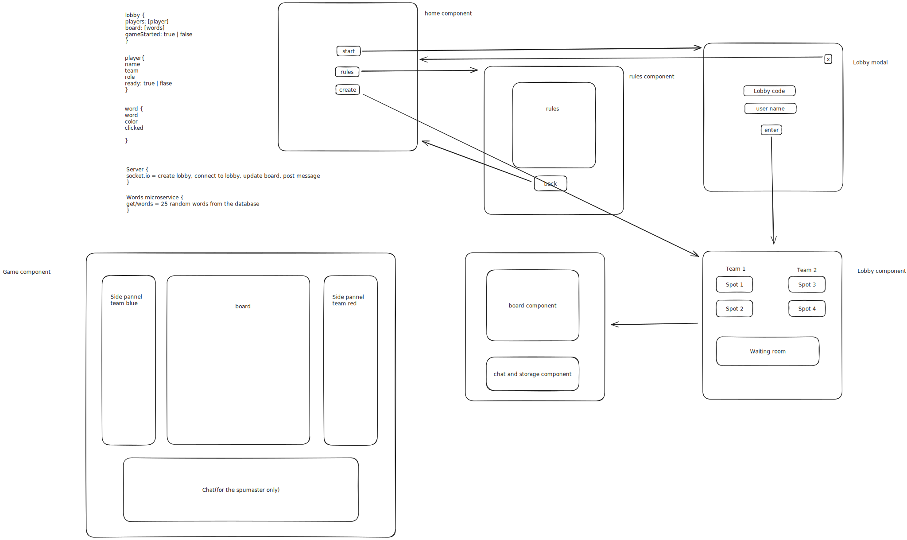

## Getting started

To start the project you'll need to do npm install in the root, client, server and word-microservice folders to start the client you'll then run npm start on the client folder, for the servers you'll need to have mongo running and execute nodemon index.js on the respective folder

## Initial planning

This is the diagrams of the application

